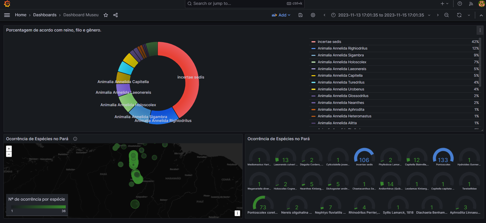

# Projeto de Análise de Dados MPEG

Este projeto foi desenvolvido por:

- João Renan Santanna Lopes
- Jefferson Figueiredo Dantas
- João Matheus Severino

## Etapas do Projeto

1. **Tratamento dos Dados da Base de Dados (occurrence.csv)**: 
   - Ferramentas Utilizadas: Google Colab e Jupyter
   - Linguagens e Bibliotecas: Python e Pandas
   - Descrição: O tratamento dos dados foi realizado utilizando Python e Pandas no ambiente Google Colab e Jupyter.

2. **Criação, Normalização, Desenvolvimento de Views e Triggers para o Banco de Dados**:
   - Ferramentas Utilizadas: Python
   - Banco de Dados: PostgreSQL
   - Descrição: Utilizou-se Python para a criação, manipulação e conexão com o banco de dados PostgreSQL, incluindo a normalização, desenvolvimento de views e triggers.

3. **Criação de Dashboard**:
   - Ferramenta Utilizada: Grafana
   - Descrição: O Dashboard foi criado utilizando o Grafana, conectando-se ao banco de dados previamente tratado e configurado.

## Pré-visualização do Dashboard

Abaixo está uma pré-visualização do Dashboard criado no Grafana para o projeto:

